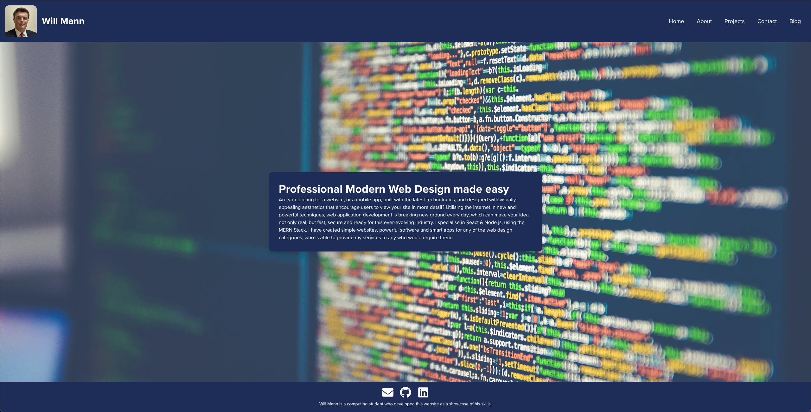

Welcome everyone!  
  
As it says in the opening page, I'm Will Mann, a recent graduate of the University of Leeds. I had this website as a hybrid portfolio piece and to advertise freelance web development work. However realising that the freelance market is saturated and that isn't the type of projects I necessarily want to do anymore, I've decided it's long overdue for an update, and a new system behind-the-hood showcasing it all.

*Website V1*

The old website was based off a GatsbyCMS utilising Sanity V1 in the backend where it was placed after a few years. I wasn't a fan of the jQuery style minified code in the background, so I've opted to replace that. I enjoyed the blue colour scheme, but I thought it was time to integrate it a bit more throughout the site with variations, so I utilised Chakra UI's theming system to create my site this time around. Also the slogan implies once again freelance web development, which I don't think this was the appropraite option for.  

The new website as you can see featured revolves around a portfolio piece, more accurately an online CV. It's purpose is to showcase my skillset to potential future employers and business partners and proving that I keep up to date. That's why for this iteration I've also decided to start a technical blog, where I intend to write about some of the interesting pieces of information I've found along the way of my ever changing web development journey, and share my knowledge with the world while promoting some of the open-source libraries I'm contributing to.

I hope you enjoy this new website, and if you're interested in getting in touch, feel free to reach out!
