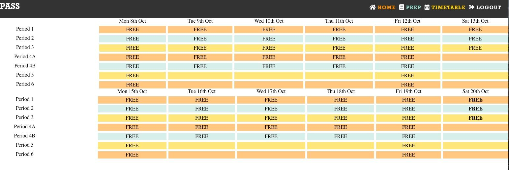
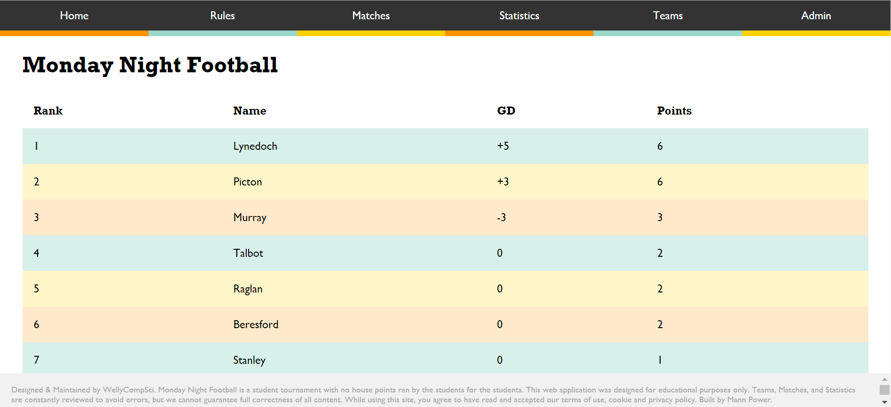
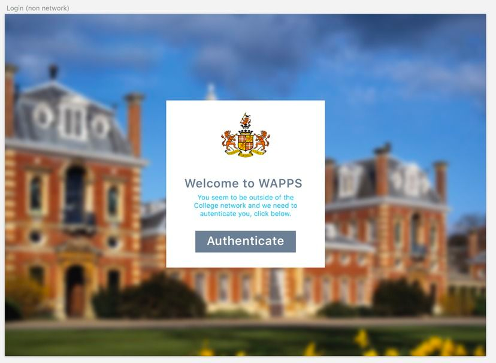
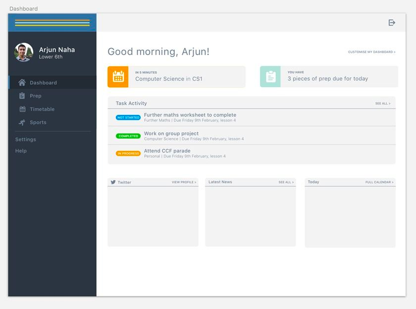
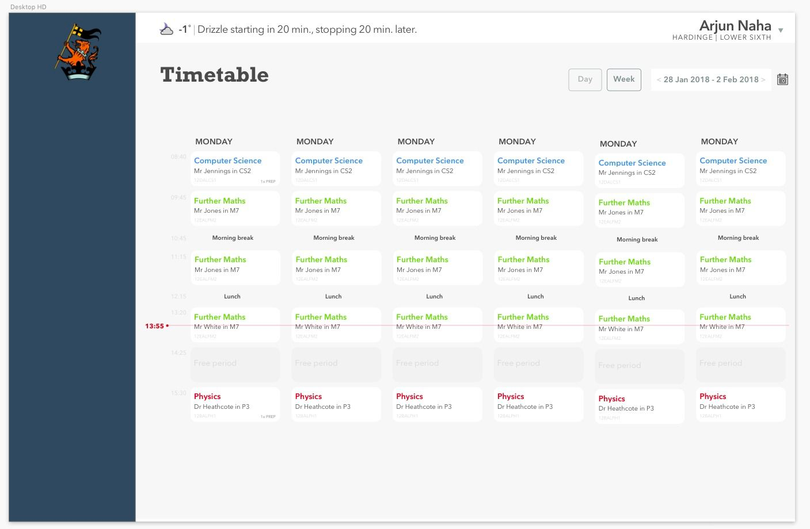
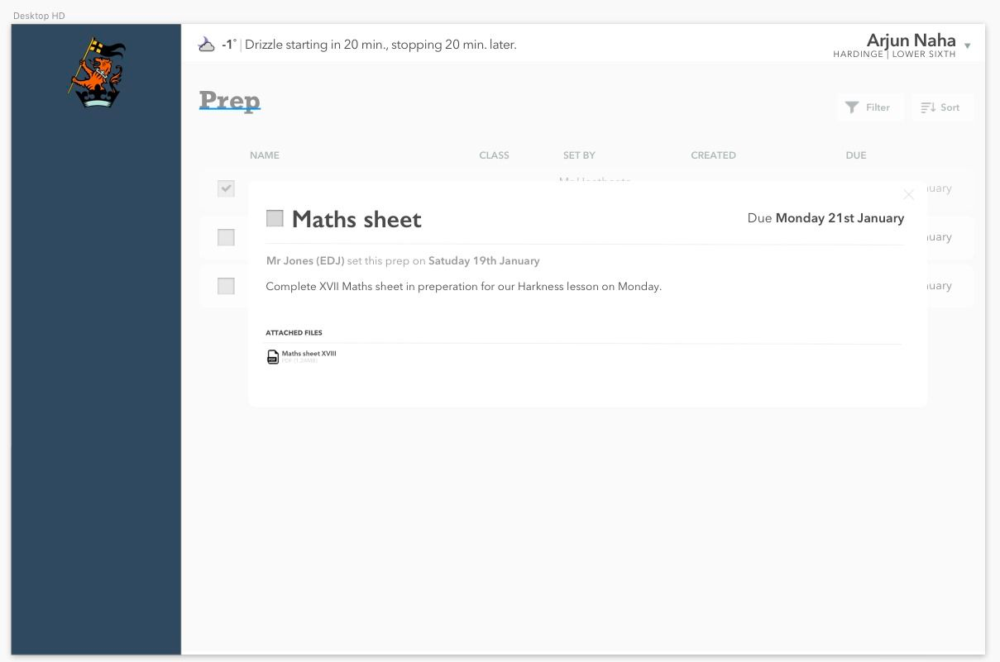
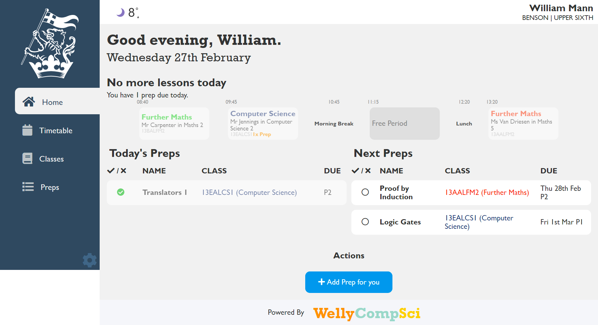
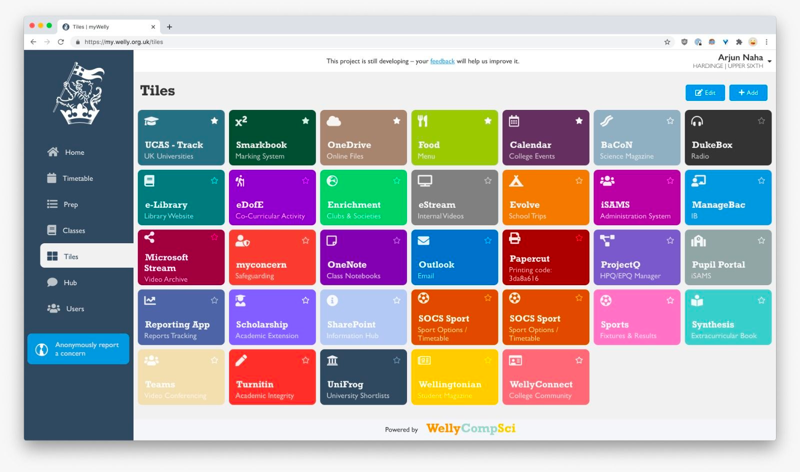
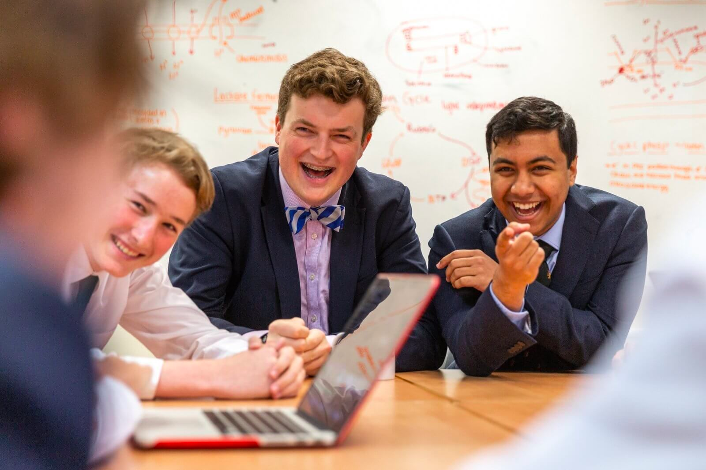

myWelly was my first big task in leading a team, to create a Prep and Timetable managment tool for Wellington College, my secondary school based in Crowthorne, UK.

This project took a long time to come together, as it was a big undertaking from setup. I feature in this podcast where we talk about how it came together. As we were working on creating the video learning platform, we were also coming up with an idea to create a prep and timetable managment system for our college, as the current ones over the years hadn't been up to the standard that we would've liked. iSAMS, Firefly, SOCS, myDay, all these different services our college, in our opinion had wasted thousands of pounds paying for these services which they had capable students who could write a bespoke solution for much cheaper. So with the Computer Science budget behind us, and our bounding ambition ahead of us, we strived ahead with planning and designing this app.

Our first step was to get approval from the college. That way, when we started to properly develop we could ask for data without seeking approval every single time. We had used Mr Hooper to ask for approval from the IT Services team, as we thought it would be easier to attempt a task of this magnitude with the support of the college and to actually see if people would be willing to back a project like this. Long story short, the answer was yes - let's do this.

For the timeline at this point of view, I was ending 5th Form - Year 11 - and I was starting to focus on my GCSE's at this point, so this project took a bit of a backfoot, and the team I was working with consisted of Lower Sixth students (Year 12) who were doing their ASs at the time as well, so we didn't manage to progress too far. I had managed to at this points hook into the college user account authentication and lesson's database, as IT Support had graciously provided. At this point, we were writing the project in vanilla HTML/CSS/JavaScript and basic PHP, something we all were a bit more comfortable in. However looking back, we could have never have achieved the scale of the project that we did using this organisation style, partly due to our collective lack of experience. We called it at this point PASS.

Now at this time, I had written my sign in system, a fundamental starting project that set me on this career path, which you can check out here. The relevenant piece of information here is that I familiarised myself with React.js and Nodejs to make an updated version, to which I realised that the MERN stack is a futureproof technology stack, so we should plan to create myWelly with it.

Introducing Arjun Naha, of Naha Digital. Arjun joined when I was in Year 13, Upper 6th. During the previous year our idea basically grounded itself out slowly. He was in the year below me, and the first computer science scholar. While setting up WellyCompSci, we had designed and put together the idea to actually take myWelly as a concept and make it a reality.

During this year I had created a web app for our Monday Night Football league, which actually showed the students and staff that our team could create some really powerful tools for helping out the admins and more.

As between Arjun and myself we had never attempted a project on this scale before. We knew the theory, we knew what to do, but at the end of the day all this work was new to us. Our first steps were to do some preliminary designs - nothing major but some ideas on where to start.

So with these ideas we manged to start converting the project from a simple displaying of timetable data that IT Services graciously provided to an actual useful piece of software for students and staff alike.

Our first steps were to figure out how to authenticate the students/staff. At the present moment we had access to the LDAP database and used that for autentication, but unfortunately that method was a bit rudamentary, and not too future-proof. Arjun, fortunately, had a better idea. We could use OpenID Connect to authenticate the devices using the Microsoft OAuth API. We managed to register our application, and create an authentication method between our Reactjs frontend and Node.js backend.

Our next problem was figuring out where we were going to get our data from. We had managed to communicate with IT Services, who gave us access to the database storing the information from iSAMS - which included timetable data, classes, users, houses and locations - departments and others.

With access to all of the data, we started to put things together. The first function we made was the timetable page, using the data we were provided to present it in a visually appealing format.

And then we allowed the teachers to set preps for the students, which was another of our big functions.

Putting all this together, with more refinements, and we can see it begins to take shape:

And at this point, we've begun to upload this to AWS, using MongoDB Atlas for the frontend and AWS Elastic Beanstalk for the backend, with Cloudfront for the frontend distributing to an S3 instance.

At this point we began work on a React Native native iOS/Android app for the same effect. This development was easier as we had all the functions prebuilt on the web platform.

During this point, we had released to some select students as beta testing to find bugs while we worked, and we came up with an idea for a 'tiles' system, full of different clickable links for the students to use.

Each of these links are clickable, dynamic and unique to the user, a feature of the system I am very proud of.

Once we had developed this feature, we released it to the college, starting with a staff meeting and then a college wide assembly.

One of the proudest moments of my life so far would definitely be releasing a project that Arjun, myself and the team had spent the better part of 6 months developing, and hearing the feedback. It had been very, very well recieved, with good words coming in from all around.

I have always been extremely pleased with this project, as it was an amazing learning experience on how to create an application on this scale.

*(Gregor, Will, Arjun)*

Above: Gregor (Vice President 2019-20, President 2020-21), Will (President 2018-19), Arjun (Vice President 2018-19, President 2019-20)
